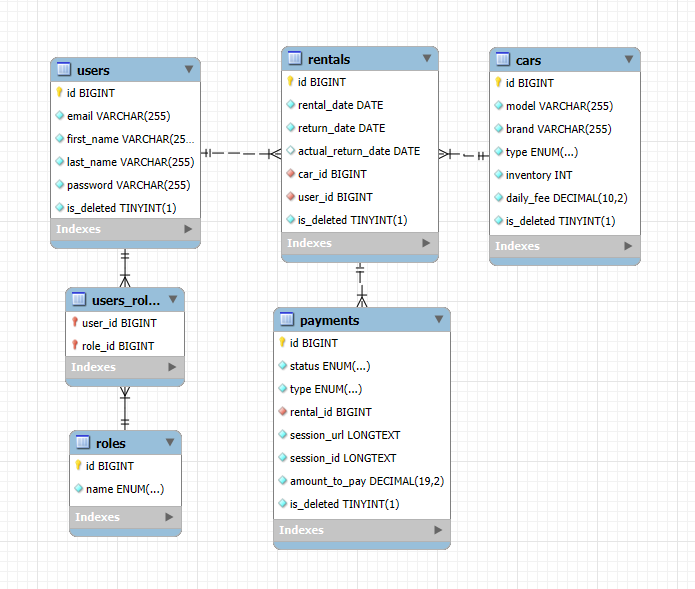

# Car Sharing Service

## Overview

This project is a fully implemented online car-sharing service designed to automate car rental processes, improve efficiency, and enhance the user experience. The system replaces manual record-keeping with a modern web-based application that allows users to rent cars, make payments, and manage their rentals seamlessly.

## Features

### User Management
- Secure registration and authentication using JWT.
- Role-based access control (MANAGER | CUSTOMER).
- Profile management for users.

### Car Management
- CRUD operations for car inventory.
- Role restrictions: only managers can add, update, or delete cars.
- Public car listing for all users.

### Rental Management
- Car rental process with automatic inventory adjustment.
- Rental history tracking.
- Filtering options for rental status and user-specific records.
- Secure return process to ensure cars are checked in properly.

### Payments Integration
- Stripe-based payment system for rentals and fines.
- Automatic calculation of rental and overdue fees.
- Secure payment session creation and tracking.
- Payment success and failure handling.

### Notifications
- Telegram bot integration for real-time notifications.
- Alerts for new rentals, overdue returns, and successful payments.
- Daily scheduled task to monitor overdue rentals.

## Tech Stack
- **Backend:** Java 21, Spring Boot 3.4.1
- **Database:** MySQL 8.0.33
- **Authentication:** JWT (jjwt-api) 0.12.6
- **Payments:** Stripe API 28.3.0
- **Documentation:** SpringDoc OpenAPI
- **Deployment:** Docker
- **Other Libraries:** Lombok 1.18.36, MapStruct 1.6.3, Liquibase 4.29.2, TelegramBots API 5.2.0

### Database structure 


## Installation & Setup

### Prerequisites
- Java 21
- Maven 3.10+
- Docker (for deployment)
- MySQL database

### Running Locally
1. Clone the repository:
   ```sh
   git clone https://github.com/VasylAzarov/car-sharing.git
   cd car-sharing
   ```
2. Configure the `.env`:
   ```env
   #Database configs
   MYSQLDB_LOCAL_PORT=your_db_local_port
   MYSQLDB_DOCKER_PORT=your_sb_docker_port
   MYSQLDB_DATABASE=your_db_name
   MYSQLDB_USER=your_db_username
   MYSQLDB_ROOT_PASSWORD=your_db_root_password

   #Spring configs
   SPRING_DATASOURCE_DRIVER_CLASS_NAME=datasource_driver
   SERVER_SERVLET_CONTEXT_PATH=servlet_context_path
   SPRING_JPA_HIBERNATE_DLL_AUTO=hibernate_option
   SPRING_LOCAL_PORT=your_spring_local_port
   SPRING_DOCKER_PORT=your_spring_docker_port
   DEBUG_PORT=your_debag_port

   #Payment configs
   PAYMENT_CALLBACK_DOMAIN=your_payment_callback_domain
   STRIPE_SECRET_KEY=your_stripe_secret_key
   STRIPE_PUBLISHABLE_KEY=your_stripe_publishable_key

   #JWT configs
   JWT_EXPIRATION=jwt_expiration_tim_in_ms
   JWT_SECRET=your_jwtsecret_key

   #Telegram-bot configs
   TELEGRAM_USERNAME=your_bot_username
   TELEGRAM_TOKEN=your_bot_token
   TELEGRAM_CHAT_ID=your_chat_id
   ```
3. Run Liquibase migrations:
   ```sh
   mvn liquibase:update
   ```
4. Build and run the application:
   ```sh
   mvn spring-boot:run
   ```

### Running with Docker
1. Build the Docker image:
   ```sh
   docker build -t car-sharing .
   ```
2. Run the container:
   ```sh
   docker-compose up -d
   ```

## Deployment
- Dockerized for easy deployment.
- Uses `.env` files for sensitive data management.
- CI/CD pipeline configured for automated builds and deployments.

## API Endpoints

### Authentication
- `POST /api/register` - Register a new user.
- `POST /api/login` - Authenticate and receive a JWT token.

### Cars
- `POST /api/cars` - Add a new car.
- `GET /api/cars` - Retrieve a list of available cars.
- `GET /api/cars/{id}` - View car details.
- `PUT /api/cars/{id}` - Update car details.
- `DELETE /api/cars/{id}` - Remove a car.

### Rentals
- `POST /api/rentals` - Rent a car.
- `GET /api/rentals` - View rental history.
- `GET /api/rentals/{id}` - View rented by id.
- `POST /api/rentals/{id}/return` - View return a rented car.

### Payments
- `POST /api/payments` - Initiate a payment session.
- `GET /api/payments/{userId}` - "Get all user's payments.
- `GET /api/payments/success` - Handle successful payments.
- `GET /api/payments/cancel` - Handle failed/canceled payments.

### Postman collection
[link to postman collection](https://springproject.postman.co/workspace/SpringProject-Workspace~8c470f00-7663-4779-8f0c-fecb50086022/collection/17862326-497899a1-9e49-4fb0-b6ee-4a45553c390c?action=share&creator=17862326)

## API Documentation

This project uses SpringDoc OpenAPI for API documentation. Visit the Swagger UI at `http://localhost:8080/api/swagger-ui.html` to explore the endpoints.
## Video overview
[link to loom video](https://www.loom.com/share/581c064b18164057951d90b102b7becf)

## Summary
This project successfully delivers an automated, efficient, and user-friendly car-sharing service, replacing outdated manual processes with a modern digital solution.
